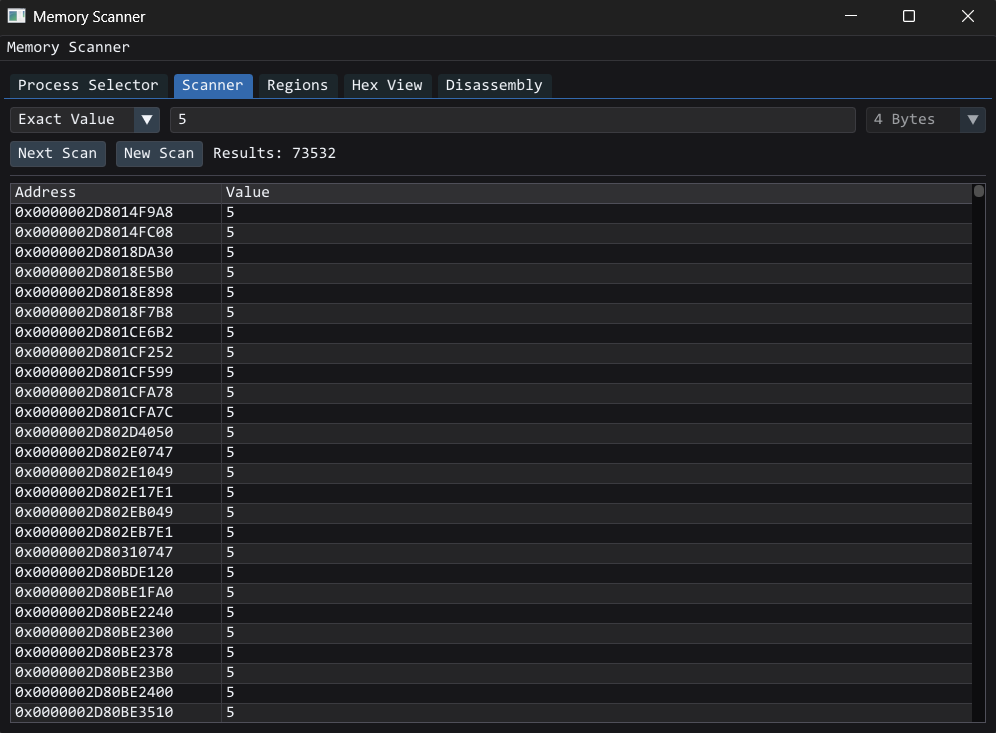
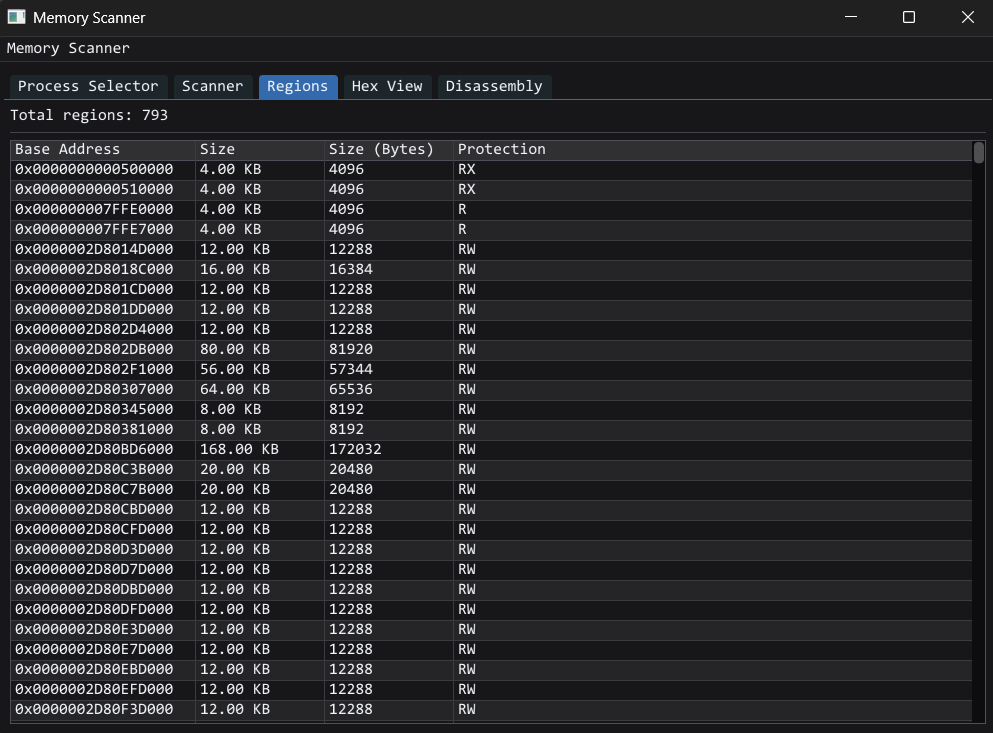
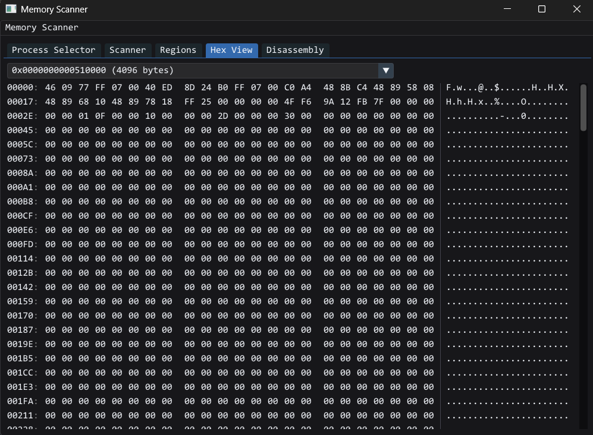
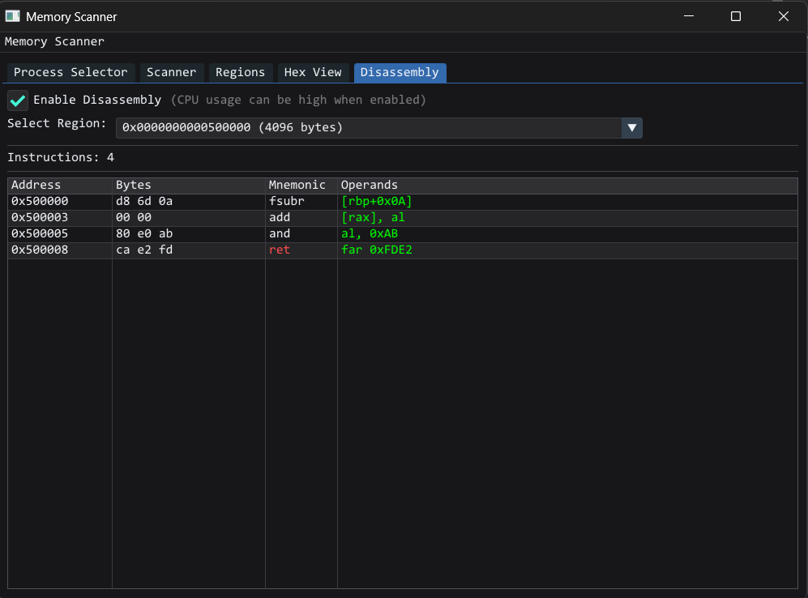

# memspy
A simple memory scanner

## Screenshots
### Scanner

### Memory Regions

### Hex View

### Disassembly

## Building
Please refer to [BUILD.md](BUILD.md) for build instructions.

## Thanks
- SDL3 for windowing [SDL3](https://github.com/libsdl-org/SDL)
- ImGui for gui [ImGui](https://github.com/ocornut/imgui)
- Zydis for disassembly [Zydis](https://github.com/zyantific/zydis)
